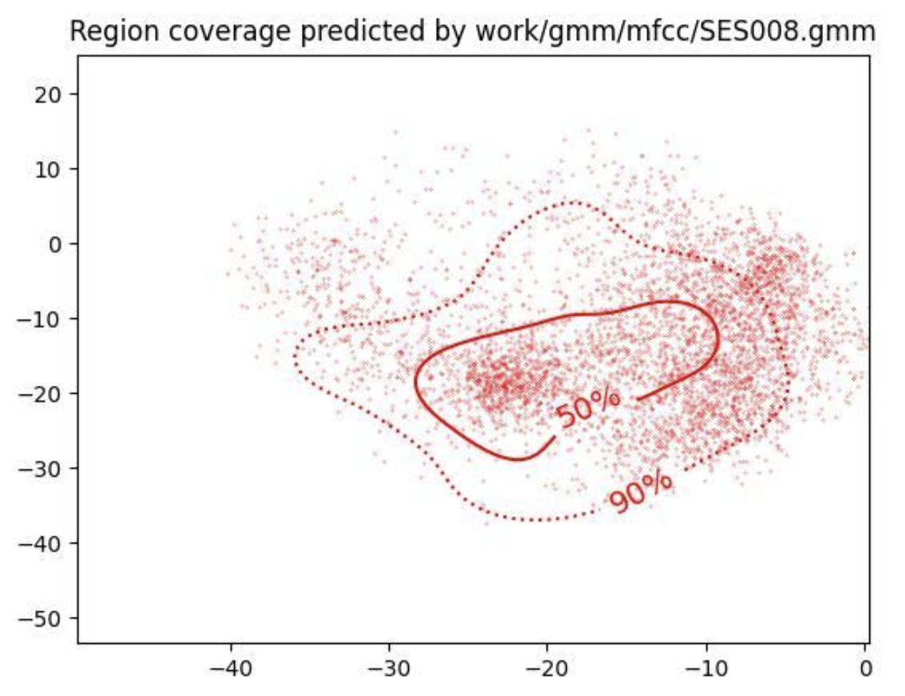

PAV - P4: reconocimiento y verificación del locutor
===================================================

Obtenga su copia del repositorio de la práctica accediendo a [Práctica 4](https://github.com/albino-pav/P4)
y pulsando sobre el botón `Fork` situado en la esquina superior derecha. A continuación, siga las
instrucciones de la [Práctica 2](https://github.com/albino-pav/P2) para crear una rama con el apellido de
los integrantes del grupo de prácticas, dar de alta al resto de integrantes como colaboradores del proyecto
y crear la copias locales del repositorio.

También debe descomprimir, en el directorio `PAV/P4`, el fichero [db_8mu.tgz](https://atenea.upc.edu/mod/resource/view.php?id=3654387?forcedownload=1)
con la base de datos oral que se utilizará en la parte experimental de la práctica.

Como entrega deberá realizar un *pull request* con el contenido de su copia del repositorio. Recuerde
que los ficheros entregados deberán estar en condiciones de ser ejecutados con sólo ejecutar:

~~~~~~~~~~~~~~~~~~~~~~~~~~~~~~~~~~~~~~~~~~~~~~~~~~~~~.sh
  make release
  run_spkid mfcc train test classerr verify verifyerr
~~~~~~~~~~~~~~~~~~~~~~~~~~~~~~~~~~~~~~~~~~~~~~~~~~~~~

Recuerde que, además de los trabajos indicados en esta parte básica, también deberá realizar un proyecto
de ampliación, del cual deberá subir una memoria explicativa a Atenea y los ficheros correspondientes al
repositorio de la práctica.

A modo de memoria de la parte básica, complete, en este mismo documento y usando el formato *markdown*, los
ejercicios indicados.

## Ejercicios.

### SPTK, Sox y los scripts de extracción de características.

- Analice el script `wav2lp.sh` y explique la misión de los distintos comandos involucrados en el *pipeline*
  principal (`sox`, `$X2X`, `$FRAME`, `$WINDOW` y `$LPC`). Explique el significado de cada una de las 
  opciones empleadas y de sus valores.

  El script wav2lp.sh se encarga de extraer características de un archivo de audio en formato .wav utilizando el conjunto de herramientas SPTK (Speech Signal Processing Toolkit). En este proceso, el script transforma la señal de audio en coeficientes de predicción lineal (LPC) y guarda estos datos en un archivo de salida con formato fmatrix.
  En el script, nos encontramos el siguiente pipeline principal:

  

- sox : es una herramienta de procesamiento de audio que convierte el archivo de entrada ($inputfile) en un archivo .raw, con codificación signed de 16 bits. Estos datos se pasan a la salida estándar ( - ).
Por tanto, vemos que:
- -t : especifica el formato de salida del fichero de audio.
- -e : especifica el tipo de codificación de los datos.
- -b : especifica el número de bits por muestra.
- '-' : especifica que la salida debe ir a la salida estándar (stdout) en lugar
de a un archivo.
- $X2X : esta herramienta nos permite la conversión entre distintos formatos
de datos. En nuestro programa, pasamos de datos short a float (+sf).
- $FRAME : segmenta una secuencia de datos en frames. La opción -l
especifica la longitud del marco y -p indica el periodo de desplazamiento. En nuestro caso, los frames son de 240 muestras y se desplazan cada 80 muestras.
- $WINDOW : aplica una ventana a cada trama de datos. La opción -l especifica la longitud de la ventana de entrada y la opción -L indica la longitud de la ventana a la salida. En nuestro código, estas longitudes son iguales a la
 
duración de las tramas (l=L=240 muestras) y se ha seleccionado la ventana
por defecto (w=0) que es la ventana de Blackman.
- $LPC : calcula los coeficientes de predicción lineal de las tramas
enventanadas que se pasan como entrada a través del pipeline. Con -l definimos el tamaño de la ventana (en nuestro caso 240 muestras) y con -m indicamos el número de coeficientes LPC que queremos, el cual determinamos en base a su orden.

- Explique el procedimiento seguido para obtener un fichero de formato *fmatrix* a partir de los ficheros de
  salida de SPTK (líneas 45 a 51 del script `wav2lp.sh`).

    

Primero, en las líneas 45 y 46, hacemos la extracción de características con los comandos SPTK explicados anteriormente. El resultado se guarda en un archivo temporal llamado $base.lp.
A continuación, se calcula el número de columnas y filas de la matriz resultante.
- Para el número de columnas, sumamos uno al orden del predictor, debido a que el primer valor se corresponde a la ganancia y esta no está incluida en los coeficientes LPC.
- Para el número de filas, primero convertimos los datos de base.lp de float a texto (ASCII) con esta instrucción $X2X +fa < $base.lp . Después, se cuentan el número de líneas en el archivo resultante utilizando wc -l. Esto nos da el número total de elementos que habrá en la matriz de características LPC.
Seguidamente, utilizamos perl para dividir el número total de elementos por el número de columnas de la matriz y así obtener finalmente el número de filas.

  * ¿Por qué es más conveniente el formato *fmatrix* que el SPTK?

El formato fmatrix es más legible y estructurado en comparación con el formato de salida de SPTK.
 
Por una parte, fmatrix incluye un encabezado que especifica el número de columnas y de filas, por lo que los índices i,j de la matriz se corresponden directamente a los coeficientes i de la trama j.
Por otra parte, el hecho de que cada fila represente un conjunto de características, facilita su interpretación y manipulación.
Por último, fmatrix permite almacenar los datos de manera más compacta y eficiente.

 
- Escriba el *pipeline* principal usado para calcular los coeficientes cepstrales de predicción lineal
  (LPCC) en su fichero <code>scripts/wav2lpcc.sh</code>:

     

- Escriba el *pipeline* principal usado para calcular los coeficientes cepstrales en escala Mel (MFCC) en su
  fichero <code>scripts/wav2mfcc.sh</code>:

     

### Extracción de características.

- Inserte una imagen mostrando la dependencia entre los coeficientes 2 y 3 de las tres parametrizaciones
  para todas las señales de un locutor.

   

   

   

  
  + Indique **todas** las órdenes necesarias para obtener las gráficas a partir de las señales 
    parametrizadas.
    Primero completamos las funciones compute de los distintos métodos en el fichero run_spkid.sh
    
    A continuación, ejecutamos las siguientes órdenes:
    
    Después, generamos los archivos de texto de cada una de las parametrizaciones:
    
    Finalmente, ejecutamos el siguiente código en MATLAB para obtener las gráficas de cada parametrización:

    % Configuración de los archivos y títulos
   files = {'lp_graf.txt', 'lpcc_graf.txt', 'mfcc_graf.txt'};
   titles = {'Linear Prediction Coefficients', 'Linear Prediction
   Cepstrum Coefficients', 'Mel Frequency Cepstrum Coefficients'};
   % Configuración del estilo de los marcadores
   markers = {'r', 'g', 'b'};
   % Configuración de las etiquetas de los ejes
   xLabel = 'Coeficiente 2';
   yLabel = 'Coeficiente 3';
   % Configuración del tamaño del marcador
   markerSize = 1.5;
   % Configuración del tamaño de la fuente del título
   titleFontSize = 15;
   % Configuración de la cuadrícula
   gridStatus = true;
   % Trazar las gráficas en ventanas separadas
   for i = 1:numel(files)
      % Cargar los datos
      data = dlmread(files{i});
      X = data(:, 1);
      Y = data(:, 2);
      % Crear una nueva ventana de gráfica
      figure;
      % Trazar los datos
      plot(X, Y, [markers{i} 'd'], 'MarkerSize', markerSize);
      % Configurar el título, etiquetas de ejes y cuadrícula
      title(titles{i}, 'FontSize', titleFontSize);
      xlabel(xLabel);
      ylabel(yLabel);
      grid(gca, gridStatus);
      % Ajustar los límites de los ejes para mostrar todas las muestras
      xlim([min(X) max(X)]);
      ylim([min(Y) max(Y)]);
    end
    

  + ¿Cuál de ellas le parece que contiene más información?
   
   Obtenemos más información cuando hay una mayor dispersión de los puntos en las gráficas, ya que esto indica que están menos correlacionados. Además, cuanto más espacio ocupan los puntos, más amplio es el rango de información relevante.
  Si observamos la gráfica de la LP, vemos que los puntos forman una especie de recta, lo cual indica que los datos siguen una tendencia clara en su estructura. Esto nos dice que hay una alta correlación entre los coeficientes 2 y 3, por tanto, estos coeficientes no aportan mucha información porque hay redundancia.
  En cuanto a las gráficas LPCC y MFCC, los coeficientes muestran una dispersión más uniforme y no se ve ningún tipo de estructura. Esto indica que hay una mayor diversidad en la representación de características y una correlación entre ellos más débil.
  En conclusión, los coeficientes MFCC son los que aportan más información porque la dispersión de puntos es mayor que en el resto y, por tanto, tiene una correlación menor, lo que indica que hay una mayor cantidad de información capturada en los coeficientes.

- Usando el programa <code>pearson</code>, obtenga los coeficientes de correlación normalizada entre los
  parámetros 2 y 3 para un locutor, y rellene la tabla siguiente con los valores obtenidos.
  A partir de los siguientes comandos obtenemos los coeficientes de correlación normalizada para el locutor:
     
     

  |                        | LP   | LPCC | MFCC |
  |------------------------|:----:|:----:|:----:|
  | &rho;x[2,3] |-0.874552|0.151488|-0.168721|
  
  + Compare los resultados de <code>pearson</code> con los obtenidos gráficamente.

  Los coeficientes LP presentan mayor correlación ya que es bastante cercana a 1 en
valor absoluto, tal y como habíamos visto antes en la gráfica.
En cuanto al LPCC y al MFCC, vemos que obtienen valores cercanos a 0 y por lo tanto obtenemos unos coeficientes más incorrelados, cosa también vista anteriormente en las gráficas.
Hemos de destacar que hemos obtenido un valor más cercano a 0 con la LPCC , aunque los valores entre el LPCC y el MFCC son muy cercanos.

De acuerdo con la teoría estudiada en clase, se recomienda que el orden del LPCC se encuentre entre 8 y 14 coeficientes, siendo 13 suficientes. Para MFCC, se suelen escoger entre 24 y 40 filtros Mel y entre 12 y 25 coeficientes.

  
- Según la teoría, ¿qué parámetros considera adecuados para el cálculo de los coeficientes LPCC y MFCC?

### Entrenamiento y visualización de los GMM.

Complete el código necesario para entrenar modelos GMM.

- Inserte una gráfica que muestre la función de densidad de probabilidad modelada por el GMM de un locutor
  para sus dos primeros coeficientes de MFCC.

  Después de completar el entrenamiento de todos los modelos, obtenemos la gráfica del locutor 008 con el siguiente comando:
  
  

- Inserte una gráfica que permita comparar los modelos y poblaciones de dos locutores distintos (la gŕafica
  de la página 20 del enunciado puede servirle de referencia del resultado deseado). Analice la capacidad
  del modelado GMM para diferenciar las señales de uno y otro.

  Para visualizar la gráfica del modelo GMM anterior junto con las muestras del locutor 008, ejecutamos el siguiente comando: 
  
  
  Ahora, comparamos el modelo anterior con el locutor 015:
  
  

Podemos observar como en el primer caso la concentración más alta de muestras coincide con la predicción de la región ya que se trata de su modelo. En cambio, cuando comparamos la predicción con las muestras de otro locutor, vemos que la correlación entre las muestras y la región es menor y, por tanto, obtenemos una modulación no muy buena.
Por tanto, podemos concluir que los modelos se adaptan mejor cuando se comparan con su locutor, por lo que podemos determinar si una cierta señal pertenece a uno u otro locutor.

### Reconocimiento del locutor.

Complete el código necesario para realizar reconociminto del locutor y optimice sus parámetros.

- Inserte una tabla con la tasa de error obtenida en el reconocimiento de los locutores de la base de datos
  SPEECON usando su mejor sistema de reconocimiento para los parámetros LP, LPCC y MFCC.

Después de optimizar los parámetros, hemos obtenido las siguientes tasas de error:
 
### Verificación del locutor.

Complete el código necesario para realizar verificación del locutor y optimice sus parámetros.

- Inserte una tabla con el *score* obtenido con su mejor sistema de verificación del locutor en la tarea
  de verificación de SPEECON. La tabla debe incluir el umbral óptimo, el número de falsas alarmas y de
  pérdidas, y el score obtenido usando la parametrización que mejor resultado le hubiera dado en la tarea
  de reconocimiento.

  LP:
  

  LPCC:
  

  MFCC:
  

Observamos que la parametrización que nos ha dado mejores resultados ha sido la LPCC con la que obtenemos la siguiente tabla:

  

 
### Test final

- Adjunte, en el repositorio de la práctica, los ficheros `class_test.log` y `verif_test.log` 
  correspondientes a la evaluación *ciega* final.

Finalmente, concluimos que el mejor sistema de parametrización ha sido el LPCC, por ello creamos los dos ficheros con esta parametrización, los cuales se encuentran en la carpeta work.
Para realizar el test final utilizamos los siguientes comandos: 
1. Ficheroclass_test.log
  
2.Ficheroverif_test.log
  

### Trabajo de ampliación.

- Recuerde enviar a Atenea un fichero en formato zip o tgz con la memoria (en formato PDF) con el trabajo 
  realizado como ampliación, así como los ficheros `class_ampl.log` y/o `verif_ampl.log`, obtenidos como 
  resultado del mismo.
